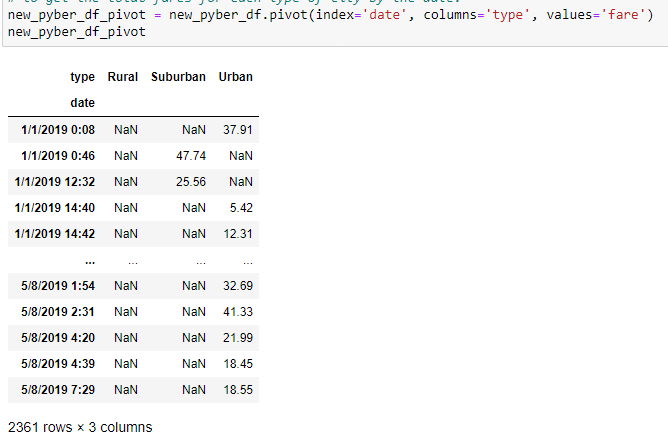

# Overview of PyBer Ride-share Data Analysis

This project is about analyzing the ride-share data from PyBer company using two datasets - *city_data.csv* and *ride_data.csv*. The *city_data.csv* dataset contains information about the name of 120 cities, total drivers and type of city e.g., Urban, Suburban or Rural. And the *ride_data.csv* dataset contains 2,375 entries of ride-sharing information of those cities in 2019 including date, time, fare and ride-ids. The key deliverables of this analysis are - 
  
  (1) to create a summary dataframe having total rides, total drivers, average fare per ride and average fare per driver for each type of cities.
  
  (2) to create a multiple line plot that shows the total weekly fares for each type of city.
  
## Results

After importing the required dependencies, the .csv datasets have been loaded into the *PyBer_Challenge.ipynb* jupyter notebook. For the sake of analysis, *city_data_df* and *ride_data_df* dataframes have been merged on the common column *"city"* to form a comprehensive dataframce *pyber_data_df* as shown below.

For both the *ride-count* and *driver-count* in each city type, Urban cities have the highest score as shown in the following bar-chart.

 

In terms of *average fare* for each city type, Urban cities show lower average fares but a lot more rides than Suburban and Rural cities. Rural cities have higher average fares but lower number of rides. The following scatter-plot / bubble-chart explains the scenario.

If we dive down a little further into the dataframe, we can get the data distribution info like mean, median, range of data, outliers (if any) etc. from the  *Ride Count Data*, *Ride Fare Data* and *Driver Count Data* for each city type, as shown below.

  

The similar analysis can better be visualized using pie-charts as shown below.

  

As the first deliverable of this project, a summary dataframe has been produced after a sequence of rigorous analysis on the dataframes and dataseries along the way. As mentioned earlier, the summary dataframe is having total rides, total drivers, average fare per ride and average fare per driver for each type of cities, as shown in the following figure.

The second deliverable is to create a multiple-line graph that shows the total fares for each week by city type. To accomplish this, we had to modify the dataframe using *pivot()* method such that the *index* is *date*, *columns* are *type* of cities and *values* are *fare*. The code and output for the pivot table is shown below.

The pivot table has been created with the intention to bring the *date* at the *index* position so that we can convert the *date* column to *datetime* type to enable further sampling at different time-series frequencies, e.g. per Week, per Month etc. The following figure shows the weekly PyBer fare for eacy city type.

The weekly PyBer fare data is presented below as a multiple-line chart for better visualization.

## Summary
The above analysis reveals the data on ride-count, driver-count, average-fare in Rural, Suburban and Rural cities. Based on the finding following recommendations can be made for the CEO of PyBer.

    (1) Both Rural and Suburban cities show lower number of drivers and higher average fares in comparison to Urban cities. Some incentives may be announced in those 2 types of cities to encourage more people to join to the driver fleet.
    
    (2) Offer a lower fare in Rural and Suburban cities to motivate people to use ride-share services more.
    
    (3) Although the Urban cities are adding the highest revenue to PyBer, the drivers in Urban cities earn almost 3.5 times less than Rural and 2.5 times less than Suburban city drivers. This is a huge gap in fare rates, which needs to be considered in future policy / benefit planning for drivers in Urban cities.
    
### Contact: m.a.moonem@gmail.com
